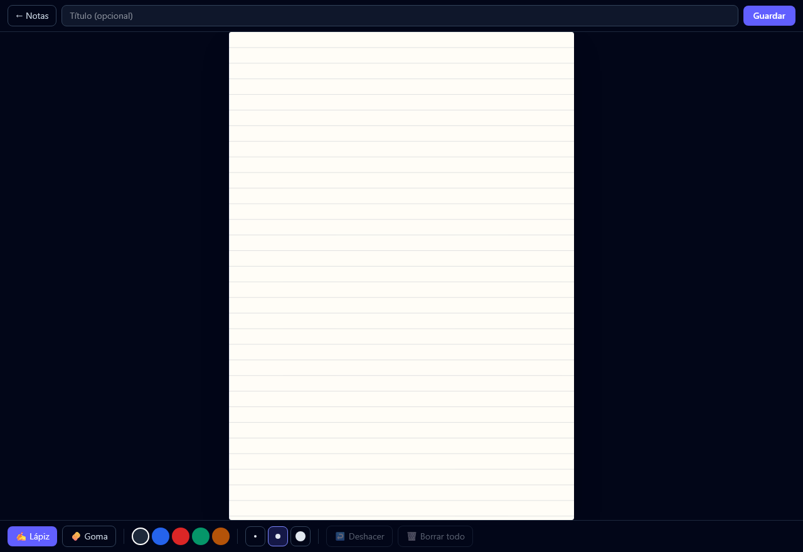
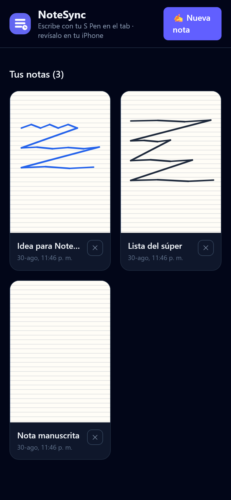
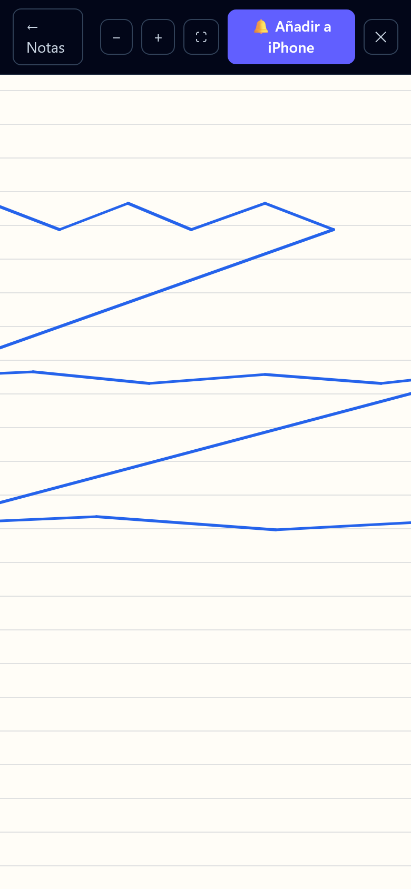

# NoteSync ✍️🔄

**Escribe notas a mano con el S Pen de tu Samsung… y revísalas en tu iPhone.**

NoteSync es un servicio full-stack (FastAPI + React PWA) que cierra la brecha entre
ecosistemas: captura **notas manuscritas** en tu tablet Samsung (con el S Pen y
grosor según la presión, como en Samsung Notes) y las deja visibles desde tu iPhone,
con opción de convertirlas en **Recordatorios** mediante **Atajos (Shortcuts)** o una
suscripción **WebCal**.


---

## Vista previa

| Editor con S Pen (Samsung tablet) | Galería (iPhone) | Visor con zoom (iPhone) |
|---|---|---|
|  |  |  |

---

## ¿Cómo funciona?

```
┌──────────────────────┐     ┌────────────────────┐     ┌──────────────────────┐
│  Samsung tablet      │     │   NoteSync API     │     │       iPhone         │
│  PWA instalada ·     │────▶│  FastAPI + SQLite  │────▶│  1) PWA: galería +  │
│  lienzo fullscreen   │     │  guarda tinta      │     │     zoom de la nota  │
│  S Pen + presión     │     │  vectorial (JSON)  │     │  2) Atajo → Recorda-│
└──────────────────────┘     └────────────────────┘     │     torios           │
                                                        │  3) WebCal (Cal.)    │
                                                        └──────────────────────┘
```

1. **Escribir (tab):** instalas la PWA (pantalla completa), tocas ✍️ nueva nota y
   escribes a mano alzada con el S Pen. Los trazos guardan **presión**, color y
   grosor, así que tu letra se ve como la escribiste.
2. **Guardar:** la tinta se guarda como **vector** (puntos + presión) en la API.
3. **Ver (iPhone):** abres la PWA desde el iPhone y ves la galería de miniaturas;
   al tocar una nota la abres en pantalla completa con **zoom con pellizco**.
4. **Recordar (opcional):** con el botón *"Añadir a iPhone"* compartes la nota
   (Share Sheet) a un Atajo que crea un **Recordatorio** en Apple; también puedes
   suscribirte al **WebCal** pretendido.

> 💡 **Editable en cualquier momento:** al estar en formato vectorial puedes volver
> a abrir una nota y seguir escribiendo, borrar trazos con la goma o deshacer.

> ⚠️ **Alcance honesto:** Samsung Notes no expone una API pública, por eso la app de
> escritura es propia (mismo encaje de lápiz + presión) en lugar de una integración
> directa. El flujo hacia el iPhone sí es real.

## Stack

| Capa | Tecnología |
|---|---|
| Backend | Python 3.13 · FastAPI · SQLAlchemy 2.0 · Pydantic v2 · icalendar |
| Frontend | React 19 · TypeScript · Vite 7 · Tailwind 4 · React Router · PWA (manifest + Service Worker) |
| Tinta | Pointer Events (`pointerType: "pen"` + `getCoalescedEvents`) · Canvas 2D · trazos vectoriales normalizados |
| Calidad | pytest (18 tests) · ruff-friendly · ESLint · TypeScript strict |

## Puesta en marcha

### API

```bash
cd backend
python -m venv .venv && source .venv/bin/activate   # Windows: .venv\Scripts\activate
pip install -r requirements.txt
cp .env.example .env
uvicorn app.main:app --port 8001 --reload            # http://localhost:8001
```

### Frontend

```bash
cd frontend
npm install
npm run dev          # http://localhost:5174 (proxy /api → :8001)
```

Para conectar el frontend a una API desplegada, define `VITE_API_BASE`.

### Tests

```bash
cd backend && pytest
```

## API

La documentación interactiva (Swagger UI) está en `http://localhost:8001/docs`.

| Método | Ruta | Descripción |
|---|---|---|
| `GET` | `/health` | Estado del servicio |
| `POST` | `/api/notes` | Crear nota (con `ink` opcional) |
| `GET` | `/api/notes` | Listar notas |
| `GET` | `/api/notes/{id}` | Obtener una nota |
| `PATCH` | `/api/notes/{id}` | Editar título/tinta de una nota (re-editar) |
| `DELETE` | `/api/notes/{id}` | Eliminar nota |
| `GET` | `/api/reminders?due=2026-08-30` | Recordatorios de un día (para el Atajo) |
| `GET` | `/api/feed.ics` | Feed WebCal (requiere `X-API-Key` si `IOS_SECRET` está definido) |
| `POST` | `/api/notes/{id}/synced` | Marcar como creado en iPhone (requiere `X-API-Key`) |

El payload de `ink` es un documento con trazos vectoriales normalizados a la
proporción de página (1414 × 2000). Ejemplo:

```json
{ "version": 1, "page": { "w": 1414, "h": 2000 },
  "strokes": [
    { "tool": "pen", "color": "#1e293b", "width": 4,
      "points": [[100, 200, 0.8], [160, 210, 0.5], [220, 190, 0.9]] }
  ] }
```

### Seguridad

Define `IOS_SECRET` en `.env` (o en Render) para proteger los endpoints que usa el
iPhone. El Atajo debe enviarlo en el header `X-API-Key`.

## Configurar el iPhone

### A) Atajo para crear Recordatorios

1. En el tab, al abrir una nota toca **"Añadir a iPhone"** → se abre el **Share Sheet**.
2. En **Atajos** crea un atajo con parámetro de entrada *"Texto/URL"* recibido del
   share, cuyo contenido se usa en una acción **Añadir nuevo recordatorio**
   (título = nota, notas = URL de la nota).
3. Alternativa simple: **Automatización → Hora del día** que llame a
   `GET https://TU-API.onrender.com/api/reminders?due=hoy` (con `X-API-Key`) y crea
   un Recordatorio por cada elemento de la lista.

### B) O suscribirte por Calendario (WebCal)

1. En tu iPhone, **Configuración → Calendario → Cuentas → Añadir cuenta → Otro →
   Añadir calendario por suscripción**.
2. Pega la URL: `https://TU-API.onrender.com/api/feed.ics`.

## Despliegue (Render)

El `render.yaml` (en la raíz del repo) define los dos servicios ya conectados:

- **`notesync-api`** — web service FastAPI (plan free). Genera un `IOS_SECRET` automáticamente.
- **`notesync-web`** — static site con el frontend. Durante el build inyecta
  `VITE_API_BASE` apuntando a `https://notesync-api.onrender.com` (referencia
  cruzada), así que el endpoint `CORS_ORIGINS` se configura solo.

Pasos (una sola cuenta gratuita en [render.com](https://render.com)):

1. Conecta tu cuenta de GitHub a Render.
2. **New → Blueprint** → selecciona `jeremyarthur/notesync`.
3. Revisa los dos servicios y pulsa **Apply** (crea y despliega ambos).
4. Abre `https://notesync-web.onrender.com` → ahí instalas la PWA en tu tab
   (menú de Chrome/Samsung Internet → *Agregar a la pantalla de inicio*).

> ⚠️ **Persistencia:** el plan free de Render usa el disco del contenedor, y se
> resetea en cada redeploy. Para que las notas sobrevivan, ve a tu Postgres en
> Render (o añade `databases:` al blueprint) y define la variable `DATABASE_URL`
> del servicio `notesync-api` apuntando a su `connectionString`. La API ya la
> soporta nativamente (SQLAlchemy).

> 🔑 **`IOS_SECRET`:** Render lo genera y lo muestra en el panel del servicio
> (Environment). Tu Atajo de iOS debe enviarlo en `X-API-Key`.

## Estructura

```
notesync/
├── backend/
│   ├── app/
│   │   ├── main.py          # entrypoint FastAPI
│   │   ├── config.py        # settings por entorno
│   │   ├── database.py      # SQLAlchemy engine/session
│   │   ├── models.py        # modelo Note (inc. ink JSON)
│   │   ├── schemas.py       # Pydantic: InkData/InkStroke + validación de tinta
│   │   └── routers/         # notes.py (CRUD + PATCH), reminders.py (incl. feed .ics)
│   ├── tests/               # 18 tests (pytest + TestClient)
│   └── render.yaml
└── frontend/
    ├── public/              # manifest, icono, service worker
    └── src/
        ├── lib/ink.ts       # renderizador compartido (editor, miniaturas, visor)
        ├── pages/Editor.tsx # lienzo fullscreen con S Pen (presión, goma, undo)
        ├── pages/Home.tsx   # galería
        └── pages/Viewer.tsx # visor con zoom por pellizco + Añadir a iPhone
```

## Roadmap

- [ ] Notificaciones push como alternativa a Shortcuts
- [ ] Sincronización selectiva e historial de versiones de cada página
- [ ] App móvil con API de Apple Reminders (CloudKit)

## Licencia

MIT — úsalo, adáptalo y aprende con él.