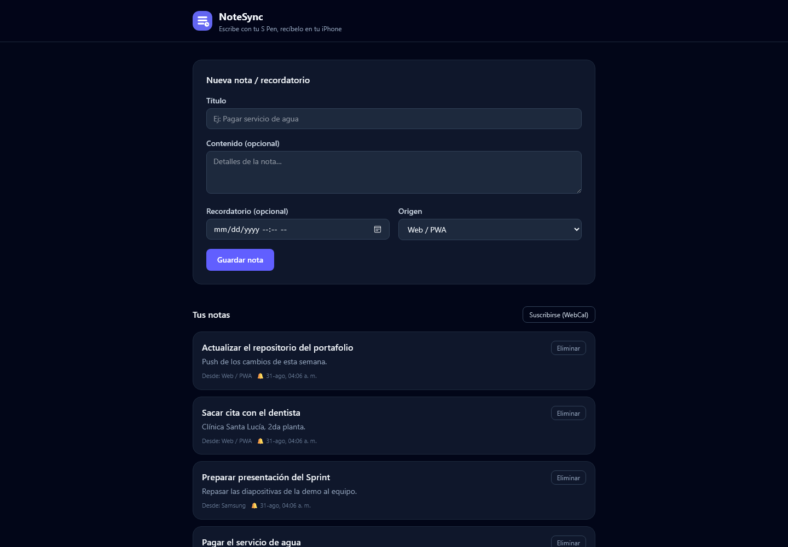

# NoteSync 🔄

**Escribe notas con el S Pen de tu Samsung… y recíbelas como recordatorios en tu iPhone.**

NoteSync es un servicio full-stack (FastAPI + React PWA) pensado para cerrar la brecha
entre ecosistemas: captura la nota donde sea (web, Samsung Notes) y la convierte en un
**recordatorio con hora** que puedes sincronizar a iOS mediante **Atajos (Shortcuts)** o
una suscripción **WebCal** en la app Calendario de Apple.


---

## Vista previa

| PWA de captura de notas |
|---|
|  |

---

## ¿Cómo funciona?

```
┌──────────────────┐     ┌───────────────────┐     ┌───────────────────┐
│  Samsung (S Pen)  │     │   NoteSync API    │     │        iPhone      │
│  Samsung Notes→   │────▶│   FastAPI+SQLite  │────▶│ 1) Atajo Shortcuts │
│  compartir/pegar  │     │   Guarda notas y  │     │ 2) WebCal (Calen- │
│  en la PWA        │     │   recordatorios   │     │    darios)         │
└──────────────────┘     └───────────────────┘     └───────────────────┘
```

1. **Captura:** escribes la nota en la PWA (o cualquier cliente que llame a la API).
2. **Reminder:** le pones una fecha/hora de recordatorio.
3. **iPhone (opción A):** un Atajo programado consulta `GET /api/reminders?due=hoy`
   y crea los Recordatorios con las acciones nativas *"Añadir nuevo recordatorio"*.
4. **iPhone (opción B):** te suscribes al feed **WebCal** (`/api/feed.ics`) y los
   recordatorios aparecen como eventos en la app Calendario, actualizándose solos.

> ⚠️ **Alcance honesto:** Samsung Notes no expone una API pública para leer notas.
> Por eso la captura se hace *compartiendo/pegando* el texto en la web (en 2 toques),
> no por integración directa con la app. El resto del flujo hacia iPhone sí es real.

## Stack

| Capa | Tecnología |
|---|---|
| Backend | Python 3.13 · FastAPI · SQLAlchemy 2.0 · Pydantic v2 · icalendar |
| Frontend | React 19 · TypeScript · Vite 7 · Tailwind 4 · PWA (manifest + Service Worker) |
| Calidad | pytest (10 tests) · ruff-friendly · ESLint · TypeScript strict |

## Puesta en marcha

### API

```bash
cd backend
python -m venv .venv && source .venv/bin/activate   # Windows: .venv\Scripts\activate
pip install -r requirements.txt
cp .env.example .env
uvicorn app.main:app --port 8001 --reload            # http://localhost:8001
```

### Frontend

```bash
cd frontend
npm install
npm run dev          # http://localhost:5174 (proxy /api → :8001)
```

Para conectar el frontend a una API desplegada, define `VITE_API_BASE`.

### Tests

```bash
cd backend && pytest
```

## API

La documentación interactiva (Swagger UI) está en `http://localhost:8001/docs`.

| Método | Ruta | Descripción |
|---|---|---|
| `GET` | `/health` | Estado del servicio |
| `POST` | `/api/notes` | Crear nota/recordatorio |
| `GET` | `/api/notes` | Listar notas |
| `DELETE` | `/api/notes/{id}` | Eliminar nota |
| `GET` | `/api/reminders?due=2026-08-30` | Recordatorios de un día (para el Atajo) |
| `GET` | `/api/feed.ics` | Feed WebCal (requiere `X-API-Key` si `IOS_SECRET` está definido) |
| `POST` | `/api/notes/{id}/synced` | Marcar como creado en iPhone (requiere `X-API-Key`) |

### Seguridad

Define `IOS_SECRET` en `.env` (o en Render) para proteger los endpoints que usa el
iPhone. El Atajo debe enviarlo en el header `X-API-Key`.

## Configurar el iPhone (Atajo de muestra)

1. Abre **Atajos** → **Automatizaciones** → **Hora del día** (ej. 8:00).
2. **Obtener contenido de la URL** →
   `https://TU-API.onrender.com/api/reminders?due={{hoy}}` con
   *Cabeceras → Añadir → clave `X-API-Key`, valor tu clave*.
3. **Añadir nuevo recordatorio**: título, notas y fecha de cada elemento devuelto
   (`Lista` → `Repetir con cada elemento`).
4. Guardas y cada mañana tus recordatorios de NoteSync aparecen en **Recordatorios**.

### O suscribirte por Calendario

1. En tu iPhone, **Configuración → Calendario → Cuentas → Añadir cuenta → Otro →
   Añadir calendario por suscripción**.
2. Pega la URL: `https://TU-API.onrender.com/api/feed.ics`.

## Despliegue

El `render.yaml` incluido levanta la API en Render (plan gratuito). El frontend es
estático (`dist/`) y puede servirse desde cualquier hosting.

## Estructura

```
notesync/
├── backend/
│   ├── app/
│   │   ├── main.py          # entrypoint FastAPI
│   │   ├── config.py        # settings por entorno
│   │   ├── database.py      # SQLAlchemy engine/session
│   │   ├── models.py        # modelo Note
│   │   ├── schemas.py       # Pydantic (entrada/salida)
│   │   └── routers/         # notes.py, reminders.py (incl. feed .ics)
│   ├── tests/               # 10 tests (pytest + TestClient)
│   └── render.yaml
└── frontend/
    ├── public/              # manifest, icono, service worker
    └── src/App.tsx          # PWA de captura de notas
```

## Roadmap

- [ ] Sincronización selectiva: marcar que no se borre de iPhone
- [ ] Notificaciones push como alternativa a Shortcuts
- [ ] App móvil con API de Apple Reminders (CloudKit)

## Licencia

MIT — úsalo, adáptalo y aprende con él.